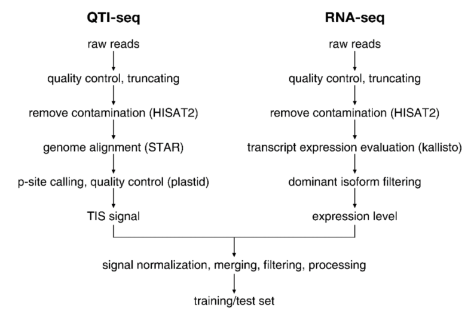
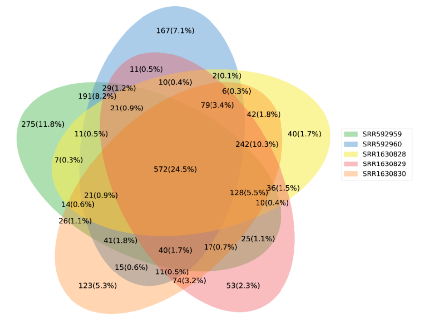
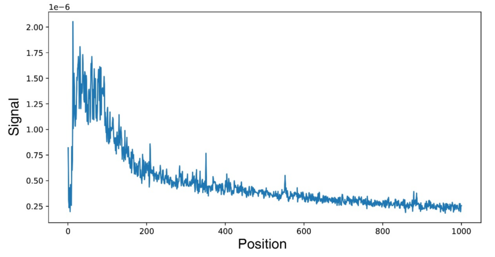
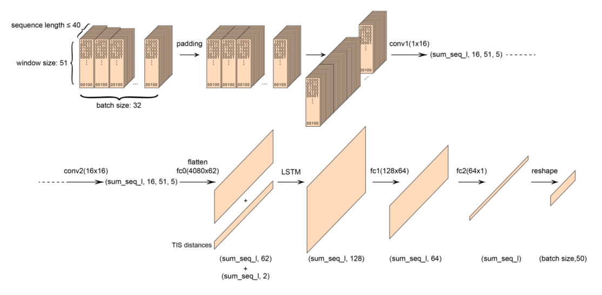
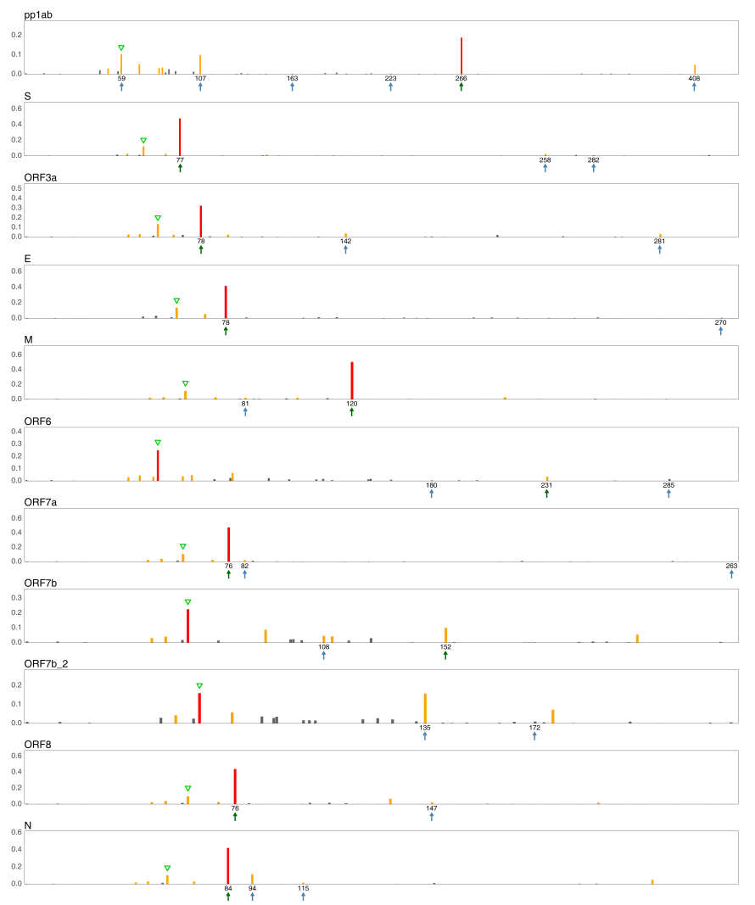
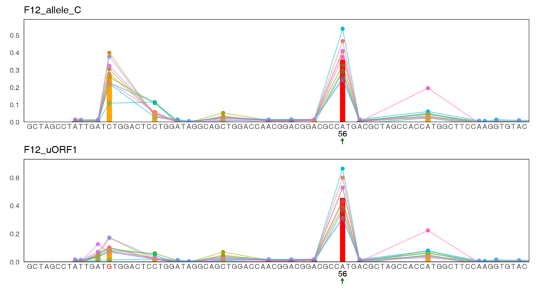

# ILTPP

**Isoform-level translation initiation site profile predictor**

This project is resulted from the study of RNA coding capability, to elucidate the interdependence between translation initiation sites.  By collecting QTI-seq (Quantitative translation initiation sequencing) datasets with supporting RNA-seq, I analyzed and obtained high-confidence TIS profiles for ~1,600 transcripts and then applied them to the training of a CNN-LSTM model. 

**Datasets used**

| **study**                     | **cell**              | **accession** | **treatment**                 |
| ----------------------------- | --------------------- | ------------- | ----------------------------- |
| (Stern-Ginossar et al., 2012) | foreskin  fibroblasts | SRR592959     | infected  with HCMV for 5 hr  |
|                               |                       | SRR592960     | infected  with HCMV for 72 hr |
| (Gao et al., 2015)            | HEK293                | SRR1630828    | control                       |
|                               |                       | SRR1630829    | Dox  Treatment                |
|                               |                       | SRR1630830    | Amino  Acid Starvation        |

**Data process**

Overlapping status between transcripts pre-filtered from all 5 samples:

For each sample, the standardized translation signal for every transcript is computed as:
$$
\hat{s}=\frac{\#QTI-seq\ reads}{TPM}
$$
Considering the potential false signals of QTI-seq and possible sequencing differences between experiments, we selected 572 transcripts common to all samples and calculated the mean signal. We then computed the median of the ratios of this mean to the transcript signals in each sample. This median was used to multiply the signals of each sample to correct for batch effects:
$$
k_i=median(\frac{\overline{\tau_{i,j}}}{\tau_{i,j}})
$$

$$
s_i^\prime=k_is_i
$$

Where 𝜏 denotes the signal of the transcripts owned by every sample. i=1,2,3,4,5, j=1,2,3,...,572. s denotes the signal of all transcripts of the 5 samples.

**Multi-transcript normalized TIS signal distribution**

**Model structure**

**SARS-CoV-2 subgenomic RNA TIS prediction result**

Green arrows label canonical ORF start sites of virus RNA. Blue arrows label novel non-canonical ORF start sites identified by study(Finkel et al., 2021). Green triangles label strong TIS signal of a CTG codon identified upstream of the leader sequence. ORF7b and ORF7b_2 are two different splice isoforms, of which ORF7b_2 does not contain a canonical ORF, but instead contains two novel ORFs.

**Mutational effect of F12_uORF1 predicted by ILTPP**

green arrows and numbers label TIS of the luciferase. Red base labels the designed mutation site.